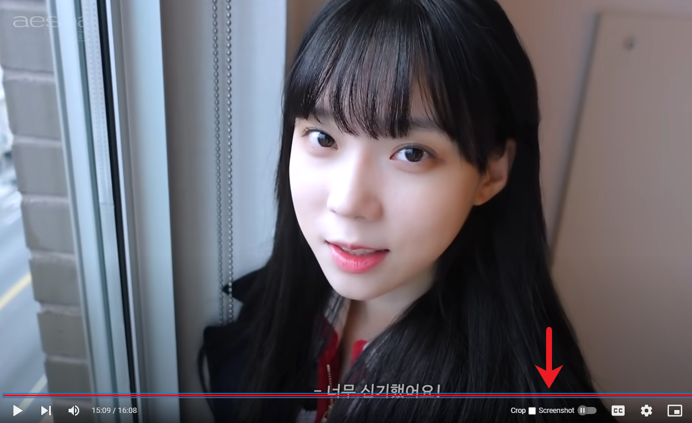
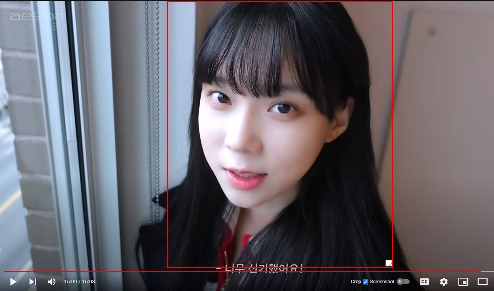

# Screenshot YouTube – a Chrome extension
Take a screenshot of any YouTube video with one click

This extension is a fork of the [Screenshot YouTube Extension](https://chrome.google.com/webstore/detail/screenshot-youtube/gjoijpfmdhbjkkgnmahganhoinjjpohk). The fork adds two features:
* Screenshot crop tool
* Randomized unix timestamp filenames i.e: 1634137735767.jpg

By default randomized filenames are not enabled

**This extenstion is not in the Chrome store**

## Installation

## How to use the crop tool
To use the crop tool, click on the white crop square to the left of the screenshot button.

A red square should appear, this is the crop square. You can drag the square within the video frame and resize it. To capture the crop, click on the screenshot button. To remove the crop square and take fullsize screenshots, uncheck the white crop square.

**Crop square**

## Example screenshots
### Screenshot without using crop square

### Screenshot using crop square

## Known issues
* The crop square doesn't drag and causes the video to pause/unpause. Temp solution: Retry drag
* The crop square will not move if its resized to be outside of the video. Temp solution: Uncheck and then check the white crop square to start over

Original made by [Zdeněk Gromnica aka FutureMillennium](http://futuremillennium.com/).
Extended by YunkyJig